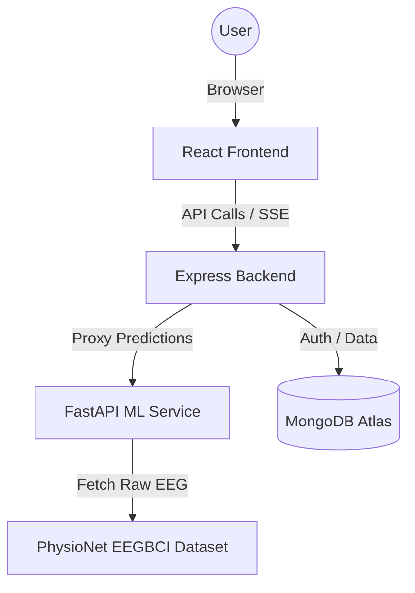

# NeuroInsight 2.0 🧠

**A Web-Based Explainable Brain–Computer Interface for Real-Time Cognitive State Visualization**

NeuroInsight 2.0 is a production-grade full-stack platform that processes real-time EEG data to predict human cognitive states. It leverages advanced Machine Learning (RandomForest) and Explainable AI (SHAP) to provide deep insights into brain activity, visualized through a modern, responsive dashboard.

---

## 🏗️ System Architecture

The project follows a decoupled microservices architecture:

1.  **Frontend**: React (Vite) + Tailwind CSS + Recharts + Framer Motion.
2.  **API Gateway**: Node.js + Express + JWT Authentication.
3.  **ML Service**: Python + FastAPI + Scikit-learn + MNE-Python + SHAP.
4.  **Database**: MongoDB (Mongoose) for session storage and user management.



---

## 🚀 Key Features

*   **Real Data Tracking**: Uses the **PhysioNet EEG Motor Movement/Imagery** dataset. No mock data.
*   **Real-time Streaming**: Implements Server-Sent Events (SSE) for millisecond-latency data flow.
*   **Explainable AI (XAI)**: Integral SHAP TreeExplainer calculates feature contributions for every single prediction.
*   **Session Persistence**: Dashboard state persists across refreshes and navigation.
*   **Secure Auth**: JWT-protected routes and session management.

---

## 🛠️ Tech Stack

| Layer | Technologies |
| :--- | :--- |
| **Frontend** | React, Vite, Tailwind CSS, Recharts, Framer Motion, Axios |
| **Backend** | Node.js, Express, JWT, Mongoose, Node-Fetch |
| **ML/Data** | FastAPI, Scikit-learn, MNE, SHAP, NumPy, Pandas, Joblib |
| **DevOps** | Render (API/ML), Vercel (Frontend), MongoDB Atlas |

---

## 💻 Local Setup

### 1. Prerequisites
*   Node.js (v18+)
*   Python (3.9+)
*   MongoDB (Local or Atlas)

### 2. ML Service Setup
```bash
cd ml_service
python -m venv .venv
.\.venv\Scripts\activate
pip install -r requirements.txt
python scripts/train_model.py  # Prepares model artifacts
uvicorn main:app --reload --port 8000
```

### 3. Backend Setup
```bash
cd backend
npm install
# Configure .env based on .env.example
npm run dev
```

### 4. Frontend Setup
```bash
cd frontend
npm install
npm run dev
```

---

## 🌍 Deployment Overview

### ML Service & Backend (Render)
1.  Connect your GitHub repo to Render.
2.  Create two **Web Services** (one for `ml_service`, one for `backend`).
3.  Set the **Root Directory** for each service accordingly.
4.  Configure Environment Variables (see `.env.example`).

### Frontend (Vercel)
1.  Import the repository to Vercel.
2.  Set the **Root Directory** to `frontend`.
3.  Configure `VITE_API_URL` to point to your Render backend.

---

## 🔮 Future Work
*   Integration with live OpenBCI hardware.
*   Support for Deep Learning (EEGNet/LSTM) models.
*   Multi-subject aggregate analytics.
*   Real-time spectral topography (Heatmaps).

---

## 📄 License
MIT License - Developed by [Neeraj Gupta](https://github.com/neeraj-gupta-dev)
